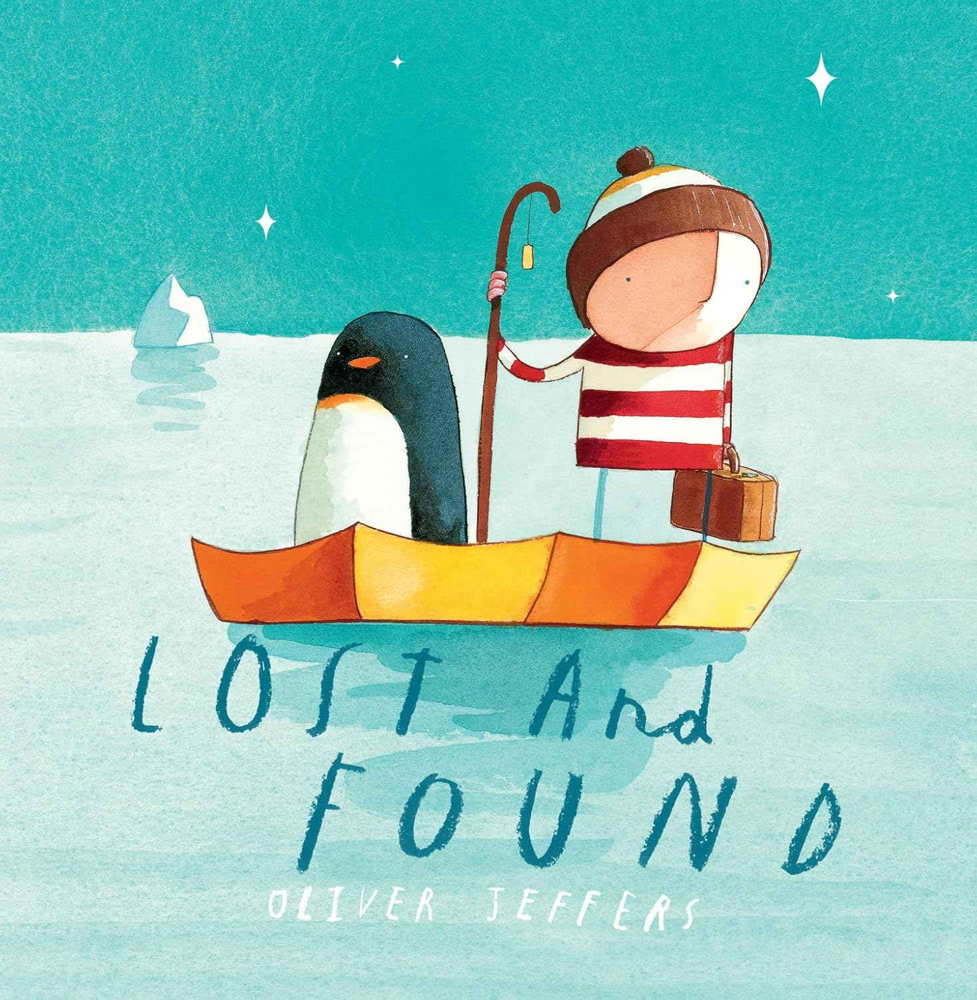

 

<i>by Oliver Jeffers </i>

> 'Once there was a boy, and one day he found a penguin at his door.. The boy decides the penguin must be lost and tries to return him..

The boy first went to the lost and found office, but no one had reported a missing penguin. So he went around asking the birds, even his little yellow duckling. Then one morning he read in a book that **“Penguins are from the South Pole!”** The boy decided he would take the penguin home himself, and they set off in his rowboat on a journey to the South Pole..

They packed everything they might need—an umbrella, a torchlight, some books, and a blanket—and began their very determined journey to their final destination. Along the way they encountered all kinds of days: the good ones and the difficult ones. There was the scorching sun while sailing across the ocean during the day, and the rainy nights when they had to share a small blanket to shelter themselves from the waves and storms. But there are also cozy moments — like when they sit together under the starry night sky and share stories..

At last, they finally reached the South Pole. Just when we think this is the end of the boy’s endeavor to bring the penguin home, **the story takes a sweet turn and unfolds into an even more lovely ending.**

I can’t even remember how many times I’ve read this book to my daughter. **I first started reading it to her when she was only two months old** (she’s 11 months now as I write this). **Even though she couldn’t understand the story yet, she was still completely hooked** when I mimicked the roaring wind over the ocean, the horn of the ship, and the nonchalant birds who didn’t want to share any information with the boy. There are just so many emotions in this story—joy, warmth, and even a few happy tears. **I can’t wait until my daughter grows older so we can read it again and share those emotional moments together for Oliver and Penguin.** :)

*I’d love to hear your favorite illustrated books in the comments!*

*#Illustrations #Emotions #ReadTogether #OliverJeffers*

